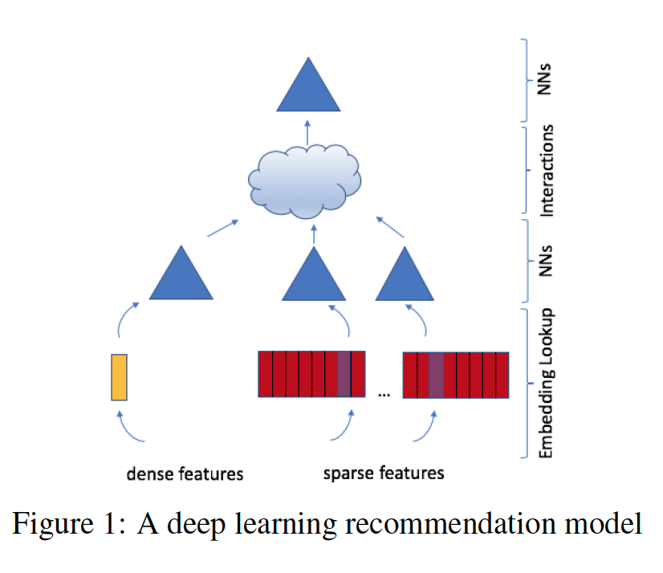

# personalization-and-rs-literature-review
This is a series literature review of personalization and recommendation systems. Though there is no clear boundary between personalization and recommendation, it is commonly to recognize the search with query involved as personalization like search engine, e-commerce search, while to treat those without query as recommendation like news and videos recommendation.

* [Personalization](#Personalization)
   * [Search Personalization with Embeddings](#Search_Personalization_with_Embeddings), 2016
   * [Personalized Ranking in eCommerce Search](#Personalized_Ranking_in_eCommerce_Search), 2019
   * [Real-time Personalization using Embeddings for Search Ranking at Airbnb](#Real-time_Personalization_using_Embeddings_for_Search_Ranking_at_Airbnb), 2018
   * [Personalized Expertise Search at LinkedIn](#Personalized_Expertise_Search_at_LinkedIn), 2016  
   
* [Recommendation](#Recommendation)
   * [Deep Learning based Recommender System:A Survey and New Perspectives](#Deep_Learning_based_Recommender_System:_A_Survey_and_New_Perspectives), 2017
   * [On the Difficulty of Evaluating Baselines:A Study on Recommender Systems](#On_the_Difficulty_of_Evaluating_Baselines:_A_Study_on_Recommender_Systems), 2019
   * [Deep Neural Networks for YouTube Recommendations](#Deep_Neural_Networks_for_YouTube_Recommendations), 2016
   * [Wide & Deep Learning for Recommender Systems](#Wide_&_Deep_Learning_for_Recommender_Systems), 2016
   * [Embedding-based News Recommendation for Millions of Users](#Embedding-based_News_Recommendation_for_Millions_of_Users), 2017
   * [Deep Learning Recommendation Model for Personalization and Recommendation Systems](#Deep_Learning_Recommendation_Model_for_Personalization_and_Recommendation_Systems), 2019
   * [Neural Collaborative Filtering](#Neural_Collaborative_Filtering), 2017
   * [Graph Convolutional Neural Networks for Web-Scale Recommender Systems](#Graph_Convolutional_Neural_Networks_for_Web-Scale_Recommender_Systems), 2018
   * [DRN:A Deep Reinforcement Learning Framework for News Recommendation](#DRN:_A_Deep_Reinforcement_Learning_Framework_for_News_Recommendation), 2018
   * [Top-K Off-Policy Correction for a REINFORCE Recommender System](#Top-K_Off-Policy_Correction_for_a_REINFORCE_Recommender_System), 2018

# Personalization

## [Search Personalization with Embeddings](https://arxiv.org/pdf/1612.03597.pdf), 2016 
   - Previous search personalization highly depends on user profile (like human generated ontology), and this paper proposes a novel embedding method to track the user's topical interest.
   - Each user is represented by two matrices **Wu,1** and **Wu,2** to represent the relationship between user and query/document, and an additional vector *vu* to represent the user topical interests. On the other side, each query/document is represented by a vector *vq* and *vd* respectively which is pre-determined using the [LDA topic model](http://www.jmlr.org/papers/volume3/blei03a/blei03a.pdf).
   - The goal is selecting a *scoring function* like 

 such that the value *f(q, u, d)* of relevant triple *(q, u, d)* is smaller than that of irrelevant triple *f(q', u, d')*. 
   - Next we train the model by minimize the total marginal value for the same user 

 where sum is taken for all relevant triples *(q, u, d)* and all irrelevant triples *(q', u, d')*.
    

- **[Personalized Ranking in eCommerce Search](https://arxiv.org/pdf/1905.00052.pdf)**, 2019 
   - This paper uses a combination of latent features learned from item co-clicks in historic sessions and content-based features that use **item title** and **price**.
   - The first step is to learn item embeddings using in-session clicks history. Each phase is represented by "id1 id2 id3" which is clicked items in the same session. Phases are filtered for at least two items and each item appears in at least 16 phases. Then item embedding is learned using skip-gram model similar as *word2vec* (with window size 5 and dimension 32).
   - Four main features will be added to the rerank step(LambdaMART) for the in-session personalization:
      - **cos_distance_ave**: Average cosine distance of the item to be ranked from the previously clicked items in the embedding space
      - **cos_distance_last**: cosine distance to the last clicked item
      - **price_ratio_mean**: ratio of the price of the current item to the average price of previously clicked items
      - **title_jaccard_sim**: Jaccard similarity of the title of the current item to the last clicked item
    
     
- **[Real-time Personalization using Embeddings for Search Ranking at Airbnb](https://astro.temple.edu/~tua95067/kdd2018.pdf)**, 2018 
   - Two types of embeddings will be learned and served as rerank features: short-term (in-session) and long-term
   - In-session listing embeddings: In each session, user clicked listing *s = (l1, l2, ..., lM)* will be treated as a context and listing embedding will be learned using the skip-gram model as in *word2vec*. However, the following parts are different:
      - Each context can be break down into two categories based on whether the last clicks is converted to a booking: If yes, then the booked listing will also be treated as one neighbor of the central listing
       
      - In the negtive sampling part, since most negative sampling will come from different market, this imbalance will lead to learning sub-optimal within-market similarities. To solve this problem, another randomly selected negative samples from the same market will be added to the loss function.
   - Cold start listing embeddings: To create embeddings for new listings, it calculates the mean vector using 3 embeddings of geographically closed listings that have embeddings and have same listing types.
   - Long-term embeddings: user-type embeddings and list-type embeddings.
      - Different user/listing types will be generated based on different rules
      - Each context is consists of user_type followed by list_type and is ordered in time. We learn each user_type/list_type in the same space using the skip-gram model
   - For the learning part, several user short-term history sets that hold user actions from last 2 weeks will be updated in real-time such as **clicked listing_ids**, **long-clicked listing_ids**(longer than 60 sec), **skipped listing_ids**, **booked listing_ids**. Then different similarity based features will be calculated for each retrieved item. These features will be incorporated, together with other non-personalized features, into learning to rank procedure.
 

- **[Personalized Expertise Search at LinkedIn](https://arxiv.org/pdf/1602.04572.pdf)**, 2016 
   - Main Methodology: The authors introduce a collaborative filtering method based on matrix factorization in the offline phase. In online phase, a ranking approach is implemented using these expertise scores as features together with other features. The feature set contains personalized (location, social connection distance) as well as non-personalized (text matching) features.
   - Novelty: The method is scalable in terms of 350 million members on about 40 thousand skills. In addtion, the collaborative filtering technique is able to infer expertise scores that the members do not even list. The authors also find a way to handle *position bias* and *sample selection bias*.
   - The expertise score computing consists of the following three steps:
      - a supervised learning step to compute *p(expert|q, member)* which outputs an initial, sparse, expertise matrix Ei, of dimensions m × s
      - a matrix factorization step that factorizes Ei into latent factor matrices, Mk and Sk of dimensions m × k and s × k respectively
      - the final score is the inner product of user and skills. For multi-skill search, it is a linear combination of each skill score. Thus all these can be precomputed offline.
   -  During ranking step, the following features will be used:
      - expertise scores as explained above
      - textual features
      - geographical features (personalized ones)
      - social features like common friends, companies and schools(personalized ones)
   - They use **coordinate ascent algorithm** to optimize NDCG at training step.
 

# Recommendation

- **[Deep Learning based Recommender System:A Survey and New Perspectives](https://arxiv.org/pdf/1707.07435.pdf)** is a good systematic survey.
 

- **[On the Difficulty of Evaluating Baselines:A Study on Recommender Systems](https://arxiv.org/pdf/1905.01395.pdf)** is a very interesting paper. Although the papers/methods it included have nothing to do with deep learning, it is worthwhile to have a summary over all those classic methods.
   - **[Bayesian MF](https://www.cs.toronto.edu/~amnih/papers/bpmf.pdf)**
   
   - **[SVD++](https://www.cs.rochester.edu/twiki/pub/Main/HarpSeminar/Factorization_Meets_the_Neighborhood-_a_Multifaceted_Collaborative_Filtering_Model.pdf)**
   
   - **[timeSVD++](http://citeseerx.ist.psu.edu/viewdoc/download?doi=10.1.1.379.1951&rep=rep1&type=pdf)**
   
- **[Deep Neural Networks for YouTube Recommendations](https://static.googleusercontent.com/media/research.google.com/en//pubs/archive/45530.pdf)**, 2016
   - Novelty: 
      - This paper applies deep neural network to both candidate generation model and ranking model
      - The age of the training example serves as a feature during training to solve the "freshness" challenge
      - The final ranking objective is based on live A/B testing results but is generally a simple function of expected watch time per impression
   - Model structure:
      - 1. deep candidate generation model
      
      - 2. deep ranking model
      
 

- **[Wide & Deep Learning for Recommender Systems](https://arxiv.org/pdf/1606.07792.pdf)**, 2016

   - Novelty: The authors jointly trained wide linear models and deep neural networks, which combines the benefits of memorization and generalization for recommender systems.
   - Model component:
      - The wide part: it is a linear combination of features. The feature set includes raw input features and transformed features(via cross-product transformation)
      - The deep part: The catogorical features firstly are converted into low-dimentional embedding feature. Then a multi-layer perceptron will be applied.
       
 

- **[Embedding-based News Recommendation for Millions of Users](http://library.usc.edu.ph/ACM/KKD%202017/pdfs/p1933.pdf)**, 2017

- **[Deep Learning Recommendation Model for Personalization and Recommendation Systems](https://arxiv.org/pdf/1906.00091.pdf)**, 2019
   - Novelty: The authors develop a state-of-the-art deep learning recommendation model and provide its implementation in both PyTorch and Caffe2 frameworks. They also design a specialized parallelization scheme utilizing model parallelism on the embedding tables.
   - Components of DLRM
      - Embeddings: besides the usual meaning, the embedding can also represent a weighted combination of multiple items, which is convenient for mini-batch learning
      - Matrix Factorization: user/item will be projected into the same latent factor space.
      - Factorization Machine: it incorporates second-order interactions into a linear model.
      - Multilayer Perceptrons
      
   - Comparison with prior models: the authors argue that higher-order interaction beyond second-order found in other networks may not necessarily be worth the additional computational/memory cost.
   - Butterfly shuffle for the all-to-all communication
   
 

- **[Neural Collaborative Filtering](https://arxiv.org/pdf/1708.05031.pdf)**, 2017
   － Novelty: Replacing the simple inner product user-item interaction in classical collaborative filtering with non-linear multi-layer perceptron(NCF, Neural Collaborative filtering). In such a setting, MF can be interpreted as a specialization of NCF.
   - General framework
   
   - GMF(generalized matrix factorization) and MLP(Nulti-layer Perceptron) and their fusion: GMF takes advantage of linearity of latent features and MLP controls non-linearity. GMF and MLP will be pre-trained (embedding on different space) and then the joint model will be trained
   
 

- **[Graph Convolutional Neural Networks for Web-Scale Recommender Systems](https://arxiv.org/pdf/1806.01973.pdf)**, 2018
   - Novelty: The authors develop a data efficient Graph Convolutional Network (GCN) algorithm: PinSage, which combines efficient random walks and graph convolutions to generate embeddings of nodes (i.e., items) that incorporate both graph structure as well as node feature information.
   - Model structure:
   
   - Model innovations:
      - The set of neighbors is selected using *importance sampling*: The neighborhood of a node *u* is defined as the *T* nodes that exert the most influence on node *u*.
      - The PinSage is trained in a supervised fashion using a max-margin ranking loss.
      - To improve efficiency when training with large batch sizes, the authors sample a set of 500 negative items to be shared by all training examples in each minibatch.
      - "Hard" negative examples(that are somewhat related to the query item but not as related as the positive item) are added for each positive training example.
      - Node embeddings via MapReduce which avoids redundant computations.

- Challenges in Applying RL for Recommender System (This is taken from the video [Reinforcement Learning for Recommender Systems: A Case Study on Youtube](https://www.youtube.com/watch?v=HEqQ2_1XRTs))
   - Large action space
   - Expensive exploration
   - Learning off-policy
   - Partial observation
   - Noisy reward

- **[DRN:A Deep Reinforcement Learning Framework for News Recommendation](http://www.personal.psu.edu/~gjz5038/paper/www2018_reinforceRec/www2018_reinforceRec.pdf)**, 2018
   - There are three challenges in news recommendation:
      - The dynamic change is difficult to handle, which is in two-fold: The news get outdated fast and the user interest might evolve over time
      - Current methods only consider immediate rewards like clicks/no-clicks. Long term ones like user return rate is not considered
      - Current methods tend to recommending similar items to users, which might get users bored.
   - Some rl recommendation methods proposed to solve the third challenge, but they usually use *\epsilon-greedy* or *Upper Condidence Bound(UCB)* to implement exploration step, which will harm user experience.
   - Novelty: The authors propose Deep Q-learning based recommendation framework, which can not only model not only immediate reward but also future reward. In addition, the authors propose *Dueling Bandit Gradient Descent(DBGD)* method for exploration which chooses random items from the neighborhood of the current recommender.
   - During training, the **state** is represented by the context features and user features, while the **action** is represented by the news features and user-news features. In addition, the Q-function is divided into two parts: The value function V(s) and the advantage function A(s, a). The former is determind by only the state, while the latter is determined by both.
 

- **[Top-K Off-Policy Correction for a REINFORCE Recommender System](https://arxiv.org/pdf/1812.02353.pdf)**, 2018

